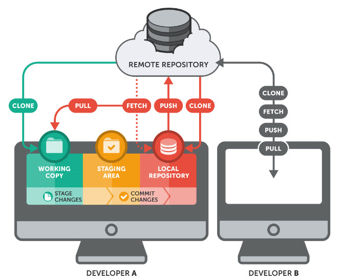
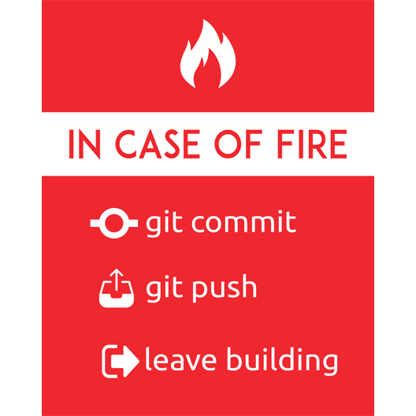

# Git Basics


## Introduction

[Git](https://en.wikipedia.org/wiki/Git) is a tool for tracking and managing changes to files: the basic principle of [**version control**](https://vimeo.com/41027679).

Version control is a system that records changes to a file or set of files over time so that you can recall specific versions later.

It helps you [keep a history](https://vimeo.com/41381741) of all the changes you did to any file in your software project and to organize versions of your software products in collaboration with other developers.

## Software Project Directory

As a developer, when you start working on a software project, you generally create a dedicated directory (also known as your project's **working directory**), and sub-directories, where you organize your files ([source code](https://en.wikipedia.org/wiki/Source_code) and various resources such as images, sounds, etc.).

For example:

```text
.
├── css
│   └── main.css
├── ico
│   ├── android-chrome-144x144.png
│   ├── apple-touch-icon.png
│   ├── browserconfig.xml
│   ├── favicon-16x16.png
│   ├── favicon-32x32.png
│   ├── favicon.ico
│   ├── mstile-150x150.png
│   ├── safari-pinned-tab.svg
│   └── site.webmanifest
├── img
│   ├── heritagego_logo_128x73.png
│   └── ic_translate_black_24px.svg
├── index.html
└── js
    ├── heritagego-service.1.0.0.js
    └── main.js
```

It's good practice to create a directory, let's call it `Devel`, in your **home directory**, to store all your software projects. You will store each of your software projects in its dedicated directory (**working directory**) below `Devel`.

For example:

```bash
$ mkdir ~/Devel
$ cd ~/Devel
$ mkdir my_amazing_project
$ mkdir my_other_amazing_project
$ mkdir my_whatever_other_amazing_project
```

```text
.
├── Desktop
├── Devel
│   ├── my_amazing_project
│   ├── my_other_amazing_project
│   └── my_whatever_other_amazing_project
├── Documents
├── Downloads
├── Music
├── Pictures
├── Public
├── Templates
└── Videos
```

## Git Repository

[Git](https://git-scm.com/book/en/v2) is often called a **repository**, or **repo** for short. It's a hidden directory `.git`, located in the **working directory** of your project, where Git stores the metadata and object database for your project, such as internal tracking data.

Git will be able to track any changes you make to any files within your projects **working directory**. This is the most important part of Git.

How is this `.git` directory created? Either you start a project from scratch or you get a copy (i.e., _clone_) of an existing project from elsewhere.

### Starting a Project from Scratch

When you start a project from scratch, you create a new directory, under your `~/Devel` directory, that you basically name against the name of your project.

For example:

```bash
$ cd ~/Devel
$ mkdir my_amazing_project
$ cd my_amazing_project
```

Then you turn it into a Git repository with the [`git init`](https://git-scm.com/docs/git-init) command. This creates a new subdirectory named `.git` that contains all of your necessary repository files.

```bash
$ git init
Initialized empty Git repository in /Home/lythanhphu/Devel/my_amazing_project/.git/
$ ls -la
total 0
drwxr-xr-x   3 lythanhphu  students    96 Jun 10 14:55 .
drwxr-xr-x  76 lythanhphu  students  2432 Jun 10 14:55 ..
drwxr-xr-x  10 lythanhphu  students   320 Jun 10 14:55 .git
```

At this point, nothing in your project is tracked yet. You will tell Git later which files you want it to track.

### Cloning an Existing Project

If you want to get a copy of an existing Git repository, you need to type the [`git clone`](https://git-scm.com/docs/git-clone) command, passing the location of the Git repository to clone.

The [location](https://git-scm.com/docs/git-clone#URLS) of a Git repository corresponds to a [Uniform Resource Identifier](https://en.wikipedia.org/wiki/Uniform_Resource_Identifier) which basically identifies the server where the Git repository is located, the file pathname of this repository, and the [transfer protocol](https://en.wikipedia.org/wiki/Application_layer) (HTTP, HTTPS, SSH, etc.) to use in order to download this Git repository.

_Note: Don't worry, we are always going to provide you the location of any Git repository you need to clone. Just provide this location to clone it!_

For example, clone the project [Git Sandbox](http://gitlab-students.int.intek.edu.vn/sm/intek-sm-git_sandbox) as follows:

```bash
$ cd ~/Devel
$ git clone http://gitlab-students.int.intek.edu.vn/sm/intek-sm-git_sandbox.git
Cloning into 'intek-sm-git_sandbox'...
remote: Counting objects: 23, done.
remote: Compressing objects: 100% (19/19), done.
remote: Total 23 (delta 2), reused 0 (delta 0)
Unpacking objects: 100% (23/23), done.
$ cd intek-sm-git_sandbox
$ ls -la
total 0
drwxr-xr-x   3 lythanhphu  students     96 Jun 10 14:55 .
drwxr-xr-x  76 lythanhphu  students   2432 Jun 10 14:55 ..
drwxr-xr-x  10 lythanhphu  students    320 Jun 10 14:55 .git
-rw-r--r--   1 lythanhphu  students  24344 Jun 10 14:55 gitub_sandbox_icon.png
-rw-r--r--   1 lythanhphu  students  43926 Jun 10 14:55 sandbox_icon.png
-rw-r--r--   1 lythanhphu  students   4058 Jun 10 14:55 sandbox_icon.svg
```

That creates a directory named `intek-sm-git_sandbox`, initializes a `.git` directory inside it, pulls down all the data for that repository, and checks out a working copy of the latest version.

## Identifying Yourself

The [first time you use Git](https://vimeo.com/41493906), you need to [define your email address and user name](https://git-scm.com/book/en/v2/Getting-Started-First-Time-Git-Setup) associated with any code changes (**commits**) you are going to make in each of your Git repositories.

For that, you need to use the [`git config`](https://git-scm.com/docs/git-config) command to set the Git global variables `user.name` and `user.email`.

For example, let's say that your name was LÝ Thanh Phú and your email address was `lythanhphu@intek.edu.vn`, you would define these variables as follows:

```bash
$ git config --global user.name "LÝ Thanh Phú"
$ git config --global user.email "lythanhphu@intek.edu.vn"
```

_Note: Replace the user name and email address with yours._

You can verify the user name and the email address you have defined as follows:

```bash
$ git config --global user.name
LÝ Thanh Phú
$ git config --global user.email
lythanhphu@example.com
```

## Starting to Work with Git

### Adding a new File

Git doesn't automatically track any new files that you add to your **working directory**.

There are files in your project you want Git to track, such as [source code](https://en.wikipedia.org/wiki/Source_code), images, and other data specific to your project.

There are other files that you don't want Git to track. We will see, in another section, what these files are.

The first file you want to add to your project, and that you want Git to track, is the [`README.md` file](https://en.wikipedia.org/wiki/README). This is a text file that documents your project. It is written using a very simple formatting syntax called [Markdown](https://en.wikipedia.org/wiki/Markdown).

For example:

```bash
# Create an empty file README.md.
$ touch README.md
```

When you create this file, and any other files, Git doesn't initially track them. The `git status` command informs you, among other information, which files have been added to your **working directory** but are not currently tracked by Git:

```bash
$ git status
On branch master

No commits yet

Untracked files:
  (use "git add <file>..." to include in what will be committed)

	README.md

nothing added to commit but untracked files present (use "git add" to track)
```

Use the [`git add`](https://git-scm.com/docs/git-add) command to request Git to track this file. The `git status` command now indicates that your new file `README.md` has been added to Git:

```bash
$ git add README.md
$ git status
On branch master

No commits yet

Changes to be committed:
  (use "git rm --cached <file>..." to unstage)

	new file:   README.md
```

This _change_ (i.e., the fact you have added this new file to Git) has not been totally saved (**committed**). This change has just been **staged**. Your change has been placed in the **staging area** of Git. This means that Git knows about the change, but it isn't permanent in your **repository**.

_Note: Git doesn't modify the files (located in your **working directory**) that you are staging, nor does it moves them into another location. **Staging** files means that Git simply adds some information about these files in its **staging area**._

### Committing your Change

To permanently save your changes to your Git **repository**, you need to use the [`git commit`](https://git-scm.com/docs/git-commit) command. The changes are then **commmitted**.

When you commit your change, you MUST always provide at least a **short message** (less than 50 characters) summarizing your change.

For example:

```bash
$ git commit -m "Initial import"
[master (root-commit) 8ec7d22] Initial import
 1 file changed, 0 insertions(+), 0 deletions(-)
 create mode 100644 README.md
```

You MUST always write the commit message in **English**, because English is the one language that nearly all programmers in all countries can read.

You can add more detailed explanatory text to your commit message, if necessary. In that case, you MUST add a **blank line**, just after the first short line of your message, followed by one or more paragraphs hard wrapped to 72 characters.

The first line of your commit message is called the **headline** or the **subject**. The rest of your commit message is called the **body**, when entered.

The seven rules of a [great Git commit message](https://chris.beams.io/posts/git-commit/):

1. Separate subject from body with a blank line
1. Limit the subject line to 50 characters
1. Capitalize the subject line
1. Do not end the subject line with a period
1. Use the imperative mood in the subject line
1. Wrap the body at 72 characters
1. Use the body to explain _what_ and _why_ vs. _how_

**WARNING! YOU MUST \_ALWAYS\_ FOLLOW THESE RULES FOR EVERY GIT COMMIT YOU DO OR WE WILL NOT ACCEPT YOUR COMMIT AND YOU WILL LOOSE XP.**

A good commit message follows this template:

```text
Capitalized, short (50 chars or less) summary

More detailed explanatory text, if necessary.  Wrap it to about 72
characters or so.  In some contexts, the first line is treated as the
subject of an email and the rest of the text as the body.  The blank
line separating the summary from the body is critical (unless you omit
the body entirely); tools like rebase can get confused if you run the
two together.

Write your commit message in the imperative: "Fix bug" and not "Fixed bug"
or "Fixes bug."  This convention matches up with commit messages generated
by commands like git merge and git revert.

Further paragraphs come after blank lines.

- Bullet points are okay, too

- Typically a hyphen or asterisk is used for the bullet, followed by a
  single space, with blank lines in between, but conventions vary here

- Use a hanging indent
```

_Note: Once again, Git doesn't modify the files (located in your **working directory**) that you are committing, nor does it move them into another location. **Committing** the files that you have staged means that Git simply adds some information about these files in its **repository**._

### Summarizing Your First Contact with Git

So far, you should have understood that, as a developer, you are responsible for all of the files and directories contained in the **working directory** of your project... **except** the directory `.git` that Git manages itself. Don't touch it! This is Git's precious...


You should also have understood that Git doesn't keep track of any files you add in whatever subdirectories of your **working directory**, unless you explicitly tell Git to (`git add` command).

You should also have understood that a **change** corresponds to **adding** a new file, **modifying** or **deleting** a file already tracked by Git. Once again, Git will notice such changes but it is not going to do anything with them as long you explicitly tell Git to (`git add` command).

By now, I am sure that you understand that, when you tell Git to add one or more changes, Git registers these changes in its **staging area**, but Git doesn't definitively save them in its **repository**, unless you tell Git to (`git commit` command).

## Git Staging Area

One of the most confusing parts when you're first learning Git is the concept of the **staging area**, the intermediate hidden space managed by Git, between your **working directory** and Git's **repository**.

The workflow of a change is the following:


What exactly is this **staging area** for? [Jonathan IRVING](https://twitter.com/sublimegeek) provides a [clear explanation](https://dev.to/sublimegeek/git-staging-area-explained-like-im-five-1anh):

> _Imagine a box. You can put stuff into the box. You can take stuff out of the box. This box is the **staging area** of Git. You can craft commits here. Committing is like sealing that box and sticking a label on it._

## A Day in the Life of a Developer with Git

As a developer, you will continuously add and modify existing files in your **working directory**, and, even if quite rarely, delete some files from your **working directory**.

### Adding and Modifying Files

Let's practice a little bit. Modify your `README.md` file by adding the title `# Git Basics`, add 2 new files [`CHANGELOG.md`](https://keepachangelog.com/en/1.0.0/) and `VERSION`:

```bash
# Edit your file README.md and create files CHANGELOG.md and VERSION.
$ vi README.md
$ touch CHANGELOG.md
$ touch VERSION
```

The `git status` command shows you the changes you have done so far in your **working repository**:

```bash
$ git status
On branch master
Changes not staged for commit:
  (use "git add <file>..." to update what will be committed)
  (use "git checkout -- <file>..." to discard changes in working directory)

	modified:   README.md

Untracked files:
  (use "git add <file>..." to include in what will be committed)

	CHANGELOG.md
    VERSION

no changes added to commit (use "git add" and/or "git commit -a")
```

### Preparing a Commit: Staging Files

You need to tell Git which changes you want to add to the staging area, to prepare a commit.

**Stage** the 3 files `README.md`, `CHANGELOG.md` and `VERSION` with the `git add` command:

```bash
$ git add README.md CHANGELOG.md VERSION
```

_Note: You can stage all the new/modified/deleted files with the `git add .` command. However, this command could be harmful if you don't pay attention to all the changes you have done in your **working directory**: this command would include work-in-progress (WIP) files that you may not want to commit right now._

Our files `README.md` and `CHANGELOG.md` have been staged, but not yet committed:

```bash
$ git status
On branch master
Changes to be committed:
  (use "git reset HEAD <file>..." to unstage)

	new file:   CHANGELOG.md
	modified:   README.md
	new file:   VERSION
```

### Resetting Staged Files

Should you decide not to commit some of the changes you have staged, you can use the [`git reset`](https://git-scm.com/docs/git-reset) command to unstage some of these changes. This command doesn't undo the changes you have done in your files, it just requests Git not to include these changes in a coming commit: i.e., remove the corresponding files ofrom Git's **staging area**.

Let's say we're not sure whether we really need the file `VERSION` in our project. We don't want to delete if from our **working directory**. We just don't want to **stage** this file anymore: we want Git to remove this change from its **staging area**:

```bash
$ git reset VERSION
$ git status
On branch master
Changes to be committed:
  (use "git reset HEAD <file>..." to unstage)

	new file:   CHANGELOG.md
	modified:   README.md

Untracked files:
  (use "git add <file>..." to include in what will be committed)

	VERSION
```

Perfect! The file `VERSION` has been unstaged. It won't be part of the next **commit**. The files `README.md` and `CHANGELOG.md` remain staged. We can now save our changes to Git **repository** with the [`git commit`](https://git-scm.com/docs/git-commit) command:

```bash
$ git commit -m "Add the project's title"
[master be12ccd] Add the project's title
 2 files changed, 1 insertion(+)
 create mode 100644 CHANGELOG.md
```

Done!

### Logical Commits

You may have noticed that the message **"Add the project's title"** of the last **commit**, which includes the 2 files `README.md` and `CHANGELOG.md`, has little to do with adding the new file `CHANGELOG.md`. **That's bad!** We should have staged and committed each of these files independently from each other.

Instead of committing all of the changes you've made since the last commit, the **staging area** lets you group **related changes** into highly focused snapshots before actually committing it to the project history. This means you can make all sorts of edits to unrelated files, then go back and split them up into **logical commits** by adding **related changes** to the **staging area** and **commit them piece-by-piece**.

It's important to create atomic commits (i.e., logical commit) so that it's easier to track down bugs and revert changes with a minimal impact on the rest of the project.

### Commit Frequency

How often should you commit your changes? As often as you need. There is no limit.

Normally, you commit your changes as often you have completed a feature (unit of functionality that satisfies a requirement), fixed a [bug](https://en.wikipedia.org/wiki/Software_bug), or more generally speaking: written a [patch](<https://en.wikipedia.org/wiki/Patch_(computing)>), [refactored code](https://en.wikipedia.org/wiki/Code_refactoring), documented some code, etc.

In practice, that means you should commit a few times per hour.

The best practice is that you should always commit code that works, or at least code that [compiles](https://en.wikipedia.org/wiki/Compilation_error). But there will be some exceptional situations where you haven't finished code you were working on and have to leave the computer you were using. In such a case, you might need to commit your code, still in the state of a [work in progress](http://www.ifsq.org/work-in-progress.html).

## Ignoring Non-Source Files

There are actually some files in your **working directory** that you don't want Git to keep track of, that you don't want to publish, that you don't need to share with other developers who would copy your Git **repository**.

These files could be the result of a [compilation process](https://en.wikipedia.org/wiki/Compiler) that translates your source code into binary code (e.g., [executable code](https://en.wikipedia.org/wiki/Executable), [bytecode](https://en.wikipedia.org/wiki/Bytecode), etc.). These files could be your personal settings of [Integrated development environment (IDE)](https://en.wikipedia.org/wiki/Integrated_development_environment) tools your are using to edit your source code. The files could be any other personal data that you don't need to share with anyone, but which are needed in your **working directory**.

THE RULE IS: **NEVER EVER ADD FILES TO ANY GIT REPOSITORY THAT ARE NOT REQUIRED** FOR ANOTHER DEVELOPER TO CONTINUE DEVELOPING YOUR PROJECT! NO TEMPORARY OR GENERATED FILES, NO PERSONAL SETTINGS, NO FILES THAT SOMEONE COULD USE TO BUILD YOUR PROJECT THEMSELVES!

For example: If we open our project with an IDE such as [PyCharm](https://www.jetbrains.com/pycharm/), this IDE creates a `.idea` directory in our **working directory** where it stores some configuration files:

```text
.
├── .git
├── .idea
│   ├── codeStyles
│   │   └── Project.xml
│   ├── dbnavigator.xml
│   ├── intek-sm-git_sandbox.iml
│   ├── misc.xml
│   ├── modules.xml
│   ├── vcs.xml
│   └── workspace.xml
├── CHANGELOG.md
├── README.md
└── VERSION
```

Git sees this new directory, i.e., the change we have done in our **working directory**:

```bash
$ git status
On branch master
Untracked files:
  (use "git add <file>..." to include in what will be committed)

	.idea/
	VERSION

nothing added to commit but untracked files present (use "git add" to track)
```

It's pretty annoying, because Git will continue to inform us about this change, while we will never stage or commit it. Indeed, we don't want to remove this directory and files from our **working directory** as our IDE needs them. We just want Git to **ignore** them. This is what the [`.gitignore` file](https://git-scm.com/docs/gitignore) is about.

A `.gitignore` file specifies intentionally untracked files that [Git should ignore](https://www.atlassian.com/git/tutorials/saving-changes/gitignore). We simply create a file `.gitignore` in the root directory of our project's **working directory**, and we add the path of files which we would like to ignore.

```bash
# Make sure we are in the root directory of our project's working
# directory.
$ cd ~/Devel/my_amazing_project
# Create the file .gitignore if it does not exist yet, and append to
# this file the path of files which we would like to ignore.
$ echo .idea >> .gitignore
```

Git now ignores our `.idea` directory and all the files located in this directory:

```bash
$ git status
On branch master
Untracked files:
  (use "git add <file>..." to include in what will be committed)

	.gitignore
	VERSION
```

Git sees that we have added the file `.gitignore`. This file is useful for our project. Other developers, who would copy our Git repository, would need to inform their Git which files need to be ignored. We need to add this file `.gitignore` to our Git **repository**:

```bash
$ git add .gitignore
$ git commit -m "Ignore Intellij IDE project settings directory"
[master 8340127] Ignore Intellij IDE project settings directory
 1 file changed, 1 insertion(+)
 create mode 100644 .gitignore
```

_Note: You can define [global Git ignore](https://www.atlassian.com/git/tutorials/saving-changes/gitignore#global-git-ignore-rules) patterns for all repositories on your local system, but you should be careful what patterns you choose to globally ignore, as different file types are relevant for different projects._

## Submitting Changes Remotely

When you **stage** changes and then **commit** these changes, Git applies these changes to your local **repository**, on your computer.

Git is a [distributed version control system](https://en.wikipedia.org/wiki/Distributed_version_control). Each developer has a working copy and the full change history. Git involves [remote repositories](https://git-scm.com/book/en/v2/Git-Basics-Working-with-Remotes), which are versions of your project that are hosted on the Internet.



You want to submit (**push**) the changes you have committed (your **commits**) to a Git remote repository so that other developers can download (**pull**) your latest changes and continue to work with the most recent version your project.

Why don't we directly commit our changes to the remote repository instead of committing our changes to our local repository? One of the simple reasons is that there are situations where you are not always connected to the Internet, like when you're travelling on a plane. But you still need to work on your project and be able to commit changes. You can always work with your local repository, and when you want to share your latest commits with your teammates, you simply push them to a remote repository.

To push your most recent commits to a remote repository (by default the remote repository from which you have cloned your project) use the [`git push` command](https://git-scm.com/docs/git-push).

```bash
$ git push
Enumerating objects: 9, done.
Counting objects: 100% (9/9), done.
Delta compression using up to 4 threads
Compressing objects: 100% (5/5), done.
Writing objects: 100% (9/9), 818 bytes | 409.00 KiB/s, done.
Total 9 (delta 0), reused 0 (delta 0)
To http://gitlab-students.int.intek.edu.vn/sm/intek-sm-git_sandbox.git
 * [new branch]      master -> master
```

Done! The `git push` command has transferred your latest commits from your local repository to the remote repository.

## Syncing with Remote Changes

Other developers may have worked on your project and pushed new changes to the remote repository. You need to sync their changes into your local repository to work on the last version of your project. To download all the changes that have been pushed to the remote repository, use the [`git pull` command](https://git-scm.com/docs/git-pull).

For example:

```bash
$ git pull
remote: Counting objects: 3, done.
remote: Compressing objects: 100% (3/3), done.
remote: Total 3 (delta 0), reused 0 (delta 0)
Unpacking objects: 100% (3/3), done.
From http://gitlab-students.int.intek.edu.vn/sm/intek-sm-git_sandbox
   ee9e2ab..0abeeac  master     -> origin/master
Updating ee9e2ab..0abeeac
Fast-forward
 CHANGELOG.md | 3 +++
 1 file changed, 3 insertions(+)
```

The file `CHANGELOG.md` may have been modified on the **remote repository**, and it has been updated to the latest version in your **local repository** and **working directory**.

_Note: This situation may occur even if your are the sole developer on your project. For instance: when you are using 2 computers (e.g., one at home, the other at your office) to work on your project from two different locations. In the evening, when you come back home, you need to download the latest changes you pushed before leaving the office._

## Epilogue


You have learned the essential Git commands to manage your code during the Survival Mode at Intek. Git has many more features that you will learn when you join Intek. Git is a powerful tool, but (as will all things) it requires time to master it.

You are now starting to code. You will **always** manage your project and source code at Intek with Git. Don't forget to stage, to commit (respecting the seven rules of a great commit message), and to push your changes or they could be lost.


