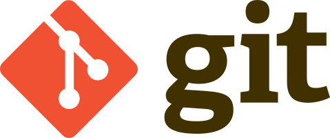
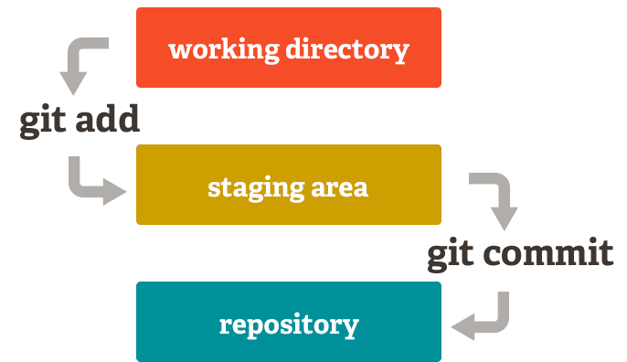
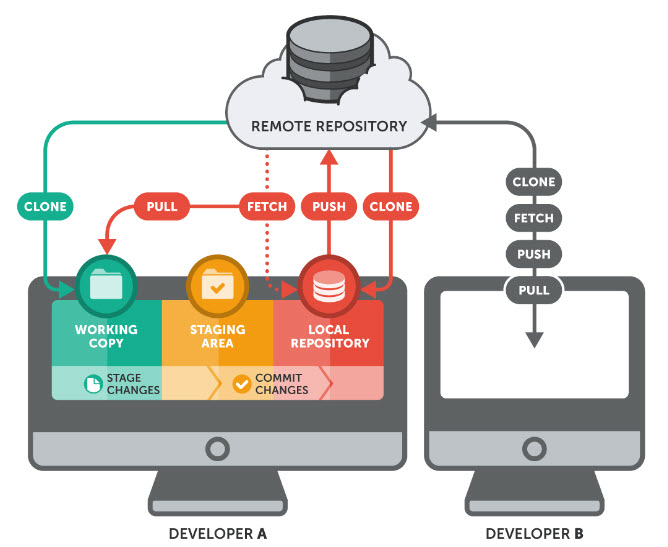
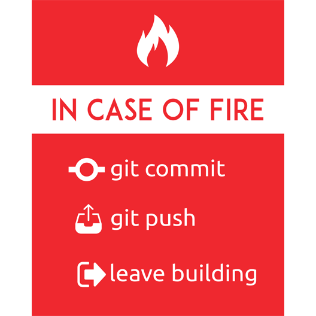

# Cơ bản về Git



## Giới thiệu

[Git](https://en.wikipedia.org/wiki/Git) là công cụ dùng để theo dõi và quản lý những thay đổi của tập tin (files): đây là nguyên tắc cơ bản của [**version control**](https://vimeo.com/41027679) (quản lý phiên bản).

Version control - Quản lý phiên bản là một hệ thống lưu trữ các thay đổi của một file hoặc một nhóm các files theo thời gian, từ đó giúp bạn có thể quay lại một phiên bản xác định nào đó sau này.

Hệ thống này giúp [lưu giữ lịch sử](https://vimeo.com/41381741) của tất cả thay đổi mà bạn thực hiện với các files trong dự án phần mềm và giúp tổ chức, sắp xếp các phiên bản tương ứng cho sản phẩm phần mềm.

## Software Project Directory (Thư mục dự án phần mềm)

Khi bắt đầu một dự án phát triển phần mềm, nhà phát triển phần mềm thường tạo một thư mục riêng cho dự án (còn gọi là **working directory** - thư mục làm việc), trong đó có các thư mục con dùng để sắp xếp và chứa các tập tin (như [source code](https://en.wikipedia.org/wiki/Source_code) - mã nguồn và các tài nguyên liên quan như hình ảnh, âm thanh, v.v.)

Ví dụ:

```text
.
├── css
│   └── main.css
├── ico
│   ├── android-chrome-144x144.png
│   ├── apple-touch-icon.png
│   ├── browserconfig.xml
│   ├── favicon-16x16.png
│   ├── favicon-32x32.png
│   ├── favicon.ico
│   ├── mstile-150x150.png
│   ├── safari-pinned-tab.svg
│   └── site.webmanifest
├── img
│   ├── heritagego_logo_128x73.png
│   └── ic_translate_black_24px.svg
├── index.html
└── js
    ├── heritagego-service.1.0.0.js
    └── main.js
```

Bây giờ, bạn hãy tạo thư mục tên `Devel` trong **home directory** (thư mục chính), để lưu trữ tất cả dự án của bạn. Trong `Devel`, bạn sẽ tạo từng thư mục làm việc dành riêng cho mỗi dự án phần mềm của mình.

Ví dụ:

```bash
$ mkdir ~/Devel
$ cd ~/Devel
$ mkdir my_amazing_project
$ mkdir my_other_amazing_project
$ mkdir my_whatever_other_amazing_project
```

```text
.
├── Desktop
├── Devel
│   ├── my_amazing_project
│   ├── my_other_amazing_project
│   └── my_whatever_other_amazing_project
├── Documents
├── Downloads
├── Music
├── Pictures
├── Public
├── Templates
└── Videos
```

## Git Repository (Kho chứa mã nguồn Git)

[Git](https://git-scm.com/book/en/v2) đi cùng với khái niệm **repository** (kho chứa mã nguồn), hay gọi tắt là **repo**. Đây là thư mục ẩn `.git`, nằm trong **working directory**, là nơi Git lưu trữ các metadata (siêu dữ liệu) và object database (cơ sở dữ liệu đối tượng) cho dự án, ví dụ: internal tracking data (dữ liệu theo dõi nội bộ).

Git có thể theo dõi toàn bộ các thay đổi mà bạn thực hiện trên các files bất kỳ trong **working directory**. Đây chính là chức năng quan trọng nhất của Git.

Thư mục `.git` được tạo ra như thế nào? Hoặc bạn sẽ tạo `.git` ngay từ đầu khi bắt đầu dự án mới, hoặc bạn sẽ copy `.git` (tức _clone_ - nhân bản) từ một dự án đã có sẵn.

### Starting a Project from Scratch (bắt đầu một dự án mới)

Khi bắt đầu dự án, hãy tạo một thư mục mới thuộc thư mục `~/Devel` và đặt tên thư mục đó theo tên dự án của bạn.

Ví dụ:

```bash
$ cd ~/Devel
$ mkdir my_amazing_project
$ cd my_amazing_project
```

Tiếp theo, chuyển thư mục đó thành một Git repository bằng lệnh [`git init`](https://git-scm.com/docs/git-init). Lệnh này sẽ tạo một thư mục con mới có tên .git, trong đó chứa tất cả các repository files cần thiết.

```bash
$ git init
Initialized empty Git repository in /Home/lythanhphu/Devel/my_amazing_project/.git/
$ ls -la
total 0
drwxr-xr-x   3 lythanhphu  students    96 Jun 10 14:55 .
drwxr-xr-x  76 lythanhphu  students  2432 Jun 10 14:55 ..
drwxr-xr-x  10 lythanhphu  students   320 Jun 10 14:55 .git
```
Lúc này, vẫn chưa có gì được tracked (theo dõi) trong dự án. Bạn sẽ phải chỉ định cho Git biết các files bạn muốn track (theo dõi).

### Cloning an Existing Project (nhân bản từ dự án có sẵn)

Nếu muốn nhân bản một Git repository có sẵn, bạn cần nhập lệnh [`git clone`](https://git-scm.com/docs/git-clone) và chỉ đến vị trí mà bạn muốn tạo Git repository mới để clone (nhân bản).

[Vị trí](https://git-scm.com/docs/git-clone#URLS) của Git repository tương ứng với [Uniform Resource Identifier](https://en.wikipedia.org/wiki/Uniform_Resource_Identifier) (Định danh Tài nguyên Thống nhất) giúp xác định máy chủ nơi chứa Git repository, pathname (tên đường dẫn) của repository này và [transfer protocol](https://en.wikipedia.org/wiki/Application_layer) (giao thức truyền thông) (HTTP, HTTPS, SSH, vv...) dùng để tải Git repository này.

_Lưu ý: Đừng lo lắng, chúng tôi sẽ cho bạn biết vị trí của Git repository mà bạn cần nhân bản (clone). Bạn chỉ cần chỉ ra vị trí mà bạn muốn chứa bản sao Git repository!_

Ví dụ, hãy clone dự án [Git Sandbox](http://gitlab-students.int.intek.edu.vn/sm/intek-sm-git_sandbox) như sau:

```bash
$ cd ~/Devel
$ git clone http://gitlab-students.int.intek.edu.vn/sm/intek-sm-git_sandbox.git
Cloning into 'intek-sm-git_sandbox'...
remote: Counting objects: 23, done.
remote: Compressing objects: 100% (19/19), done.
remote: Total 23 (delta 2), reused 0 (delta 0)
Unpacking objects: 100% (23/23), done.
$ cd intek-sm-git_sandbox
$ ls -la
total 0
drwxr-xr-x   3 lythanhphu  students     96 Jun 10 14:55 .
drwxr-xr-x  76 lythanhphu  students   2432 Jun 10 14:55 ..
drwxr-xr-x  10 lythanhphu  students    320 Jun 10 14:55 .git
-rw-r--r--   1 lythanhphu  students  24344 Jun 10 14:55 gitub_sandbox_icon.png
-rw-r--r--   1 lythanhphu  students  43926 Jun 10 14:55 sandbox_icon.png
-rw-r--r--   1 lythanhphu  students   4058 Jun 10 14:55 sandbox_icon.svg
```

Việc này giúp tạo một thư mục tên `intek-sm-git_sandbox` và một thư mục `.git` nằm trong thư mục `intek-sm-git_sandbox`, đồng thời lấy tất cả dữ liệu cho repository đó và tải về bản sao phiên bản làm việc mới nhất.

## Identifying Yourself (Định danh)

Vào [lần đầu tiên sử dụng Git](https://vimeo.com/41493906), bạn phải [xác định địa chỉ email và tên của bạn](https://git-scm.com/book/en/v2/Getting-Started-First-Time-Git-Setup). Địa chỉ email và tên này sẽ được liên kết với các thay đổi mã code - **commits** mà bạn sẽ thực hiện trong từng Git repository của bạn.

Để làm điều này, bạn cần sử dụng lệnh [`git config`](https://git-scm.com/docs/git-config) để thiết lập cho các global variables (biến toàn cục) của Git: `user.name` và `user.email`.

Ví dụ, tên bạn là Lý Thanh Phú và địa chỉ email của bạn là `lythanhphu@intek.edu.vn`, bạn sẽ thiết lập các biến `user.name` và `user.email` như sau:

```bash
$ git config --global user.name "LÝ Thanh Phú"
$ git config --global user.email "lythanhphu@intek.edu.vn"
```

_Lưu ý: Nhớ thay thế tên và địa chỉ email trong ví dụ bằng tên và địa chỉ email của bạn._

Bạn có thể kiểm tra tên và địa chỉ email đã xác định như sau:

```bash
$ git config --global user.name
LÝ Thanh Phú
$ git config --global user.email
lythanhphu@example.com
```

## Starting to Work with Git (Bắt đầu làm việc với Git)

### Thêm một file mới

Git không tự động theo dõi toàn bộ các files mới mà bạn thêm vào **working directory**.

Có những files mà bạn muốn Git theo dõi, như [source code](https://en.wikipedia.org/wiki/Source_code), các hình ảnh và dữ liệu sử dụng cho dự án của bạn.

Cũng có những files mà bạn không muốn Git theo dõi. Trong phần sau, chúng ta sẽ biết những files đó là gì.

File đầu tiên bạn muốn thêm vào dự án của mình và muốn Git theo dõi là [`README.md`](https://en.wikipedia.org/wiki/README). File này là tài liệu hướng dẫn cho dự án của bạn, được viết bằng một cú pháp định dạng rất đơn giản gọi là [Markdown](https://en.wikipedia.org/wiki/Markdown).

Ví dụ:

```bash
# Create an empty file README.md.
$ touch README.md
```
Khi bạn tạo file này hay bất kỳ file nào, Git không tự động theo dõi chúng ngay từ đầu. Lệnh `git status` sẽ thông báo cho bạn biết file nào đã được thêm vào **working directory** nhưng chưa được Git theo dõi:

```bash
$ git status
On branch master

No commits yet

Untracked files:
  (use "git add <file>..." to include in what will be committed)

	README.md

nothing added to commit but untracked files present (use "git add" to track)
```
Dùng lệnh [`git add`](https://git-scm.com/docs/git-add) để yêu cầu Git theo dõi file này. Lệnh `git status` cho biết file `README.md` mới đã được thêm vào Git:

```bash
$ git add README.md
$ git status
On branch master

No commits yet

Changes to be committed:
  (use "git rm --cached <file>..." to unstage)

	new file:   README.md
```

_Thay đổi_ này (việc bạn thêm file mới vào Git) vẫn chưa được **committed** (lưu lại hoàn toàn). Thay đổi này chỉ mới được **staged** (tổ chức). Thay đổi đã được đặt trong **staging area** (khu vực đang tổ chức) của Git, khu vực mà các files có thay đổi sẽ được ghi nhận. Điều này có nghĩa Git biết về thay đổi, nhưng thay đổi đó chưa được lưu vĩnh viễn trong **repository** của bạn.

_Lưu ý: Git không chỉnh sửa các files trong **working directory**, cũng không di chuyển chúng đến vị trí khác. **Staging** files chỉ có nghĩa là Git bổ sung một số thông tin về các files này trong **staging area** (khu vực đang tổ chức) của Git._


### Committing your Change (commit thay đổi)

Để các thay đổi của bạn được lưu vĩnh viễn vào **repository**, bạn phải sử dụng lệnh [`git commit`](https://git-scm.com/docs/git-commit). Lúc này, các thay đổi được xem là đã **commmitted** (cam kết).

Khi bạn commit một thay đổi, bạn PHẢI luôn đưa ra một **short message** (thông báo ngắn) dưới 50 ký tự để tóm tắt thay đổi của bạn:

Ví dụ:

```bash
$ git commit -m "Initial import"
[master (root-commit) 8ec7d22] Initial import
 1 file changed, 0 insertions(+), 0 deletions(-)
 create mode 100644 README.md
```

Bạn PHẢI luôn viết thông báo về commit message bằng **tiếng Anh**, vì tiếng Anh là ngôn ngữ mà hầu hết lập trình viên ở mọi quốc gia đều đọc được.

Bạn có thể bổ sung các giải thích chi tiết cho commit message (thông báo về cam kết) nếu thấy cần. Trong trường hợp đó, bạn PHẢI thêm một **blank line** (dòng trống) ngay sau hàng thông báo ngắn đầu tiên, theo sau là một hoặc nhiều đoạn văn được gói gọn trong 72 ký tự.

Hàng đầu tiên trong commit message được gọi là **headline** (tiêu đề) hoặc **subject** (chủ đề). Phần còn lại trong commit message được gọi là **body** (nội dung).

Bảy quy tắc của một [Git commit message](https://chris.beams.io/posts/git-commit/) chuẩn:

1. Phân cách chủ đề và nội dung bằng một blank line (dòng trống)
2. Giới hạn chủ đề trong 50 ký tự
3. Viết hoa chữ cái đầu tiên của chủ đề
4. Không kết thúc chủ đề bằng dấu chấm câu
5. Dùng mệnh lệnh cách trong chủ đề
6. Gói gọn phần nội dung trong 72 ký tự
7. Sử dụng phần nội dung để giải thích _what_ (cái gì) và _why_ (tại sao) thay vì giải thích _how_ (như thế nào)

**CHÚ Ý! BẠN PHẢI-LUÔN-LUÔN-TUÂN-THEO CÁC QUY TẮC NÀY ĐỐI VỚI MỖI GIT COMMIT BẠN THỰC HIỆN, NẾU KHÔNG CHÚNG TÔI SẼ KHÔNG CHẤP NHẬN COMMIT CỦA BẠN VÀ BẠN SẼ MẤT XP**

Để viết một commit message tốt, hãy theo mẫu sau:

```text
Capitalized, short (50 chars or less) summary

More detailed explanatory text, if necessary.  Wrap it to about 72
characters or so.  In some contexts, the first line is treated as the
subject of an email and the rest of the text as the body.  The blank
line separating the summary from the body is critical (unless you omit
the body entirely); tools like rebase can get confused if you run the
two together.

Write your commit message in the imperative: "Fix bug" and not "Fixed bug"
or "Fixes bug."  This convention matches up with commit messages generated
by commands like git merge and git revert.

Further paragraphs come after blank lines.

- Bullet points are okay, too

- Typically a hyphen or asterisk is used for the bullet, followed by a
  single space, with blank lines in between, but conventions vary here

- Use a hanging indent
```

_Lưu ý: Một lần nữa, hãy nhớ là Git không chỉnh sửa các files trong **woking directory** mà bạn đang committing, cũng không di chuyển chúng đến vị trí khác. **Committing** các files mà bạn đã staged chỉ có nghĩa là Git bổ sung một số thông tin về các files này vào **repository** của Git._

### Summarizing Your First Contact with Git (Tóm tắt)

Lúc này, chắc bạn đã hiểu rằng, là một developer, bạn phải chịu trách nhiệm về toàn bộ files và thư mục có trong **woking directory** (thư mục làm việc) thuộc dự án của bạn… **ngoại trừ** thư mục `.git` mà Git tự quản lý. Đừng đụng vào `.git`! Đây là tài sản quý giá của Git: Git’s precious…


Bạn đã hiểu rằng Git không theo dõi toàn bộ các files mà bạn thêm vào ở bất kỳ thư mục con nào trong **woking directory** của bạn, trừ khi bạn ra lệnh rõ ràng cho Git (dùng lệnh `git add`).

Bạn cũng hiểu rằng một **change** (thay đổi) tương ứng với việc **adding** (thêm vào) một file mới, **modifying** (hiệu chỉnh) hoặc **deleting** (xóa) một file đã được Git theo dõi. Cần nhắc lại rằng, Git nhận thấy các thay đổi này nhưng sẽ không làm gì cho đến khi bạn ra lệnh rõ ràng cho Git (dùng lệnh `git add`).

Bạn cũng đã hiểu rằng, khi bạn ra lệnh cho Git bổ sung một hoặc nhiều thay đổi, Git ghi nhận các thay đổi này trong **staging area** (khu vực đang tổ chức), nhưng không lưu lại trong **repository** của Git, trừ khi bạn ra lệnh cho Git thực hiện việc này (dùng lệnh `git commit`).

## Git Staging Area (Khu vực đang tổ chức của Git)

Một trong những phần khó hiểu nhất khi bạn học Git lần đầu là khái niệm **staging area** (khu vực đang tổ chức). Đây là một không gian ẩn trung gian giữa **woking directory** (thư mục làm việc) của bạn và **repository** của Git, và không gian này được Git quản lý.

Dưới đây là Quy trình của một thay đổi:



Chính xác thì **staging area** (khu vực đang tổ chức) dùng để làm gì? [Jonathan IRVING](https://twitter.com/sublimegeek) đưa ra [lời giải thích khá rõ ràng](https://dev.to/sublimegeek/git-staging-area-explained-like-im-five-1anh) như sau:

>_Hãy tưởng tượng đến một chiếc hộp. Bạn có thể bỏ đồ vào hộp. Bạn có thể lấy đồ ra khỏi hộp. Chiếc hộp này chính là **staging area** (khu vực đang tổ chức) của Git. Bạn có thể “nháp” các commits vào “hộp”. Committing sẽ giống như việc bạn đóng hộp lại và dán nhãn cho nó._

## Một ngày của một Developer với Git

Là một developer, bạn sẽ liên tục thêm và chỉnh sửa các files hiện hữu trong **woking directory** (thư mục làm việc), và đôi khi bạn cũng xóa một số files khỏi **woking directory**.

### Thêm và chỉnh sửa các tập tin

Hãy thực hành một chút. Hãy chỉnh sửa file `README.md` bằng cách thêm tiêu đề `# Git Basics`, bổ sung 2 files mới là [`CHANGELOG.md`](https://keepachangelog.com/en/1.0.0/) và `VERSION`:


```bash
# Edit your file README.md and create files CHANGELOG.md and VERSION.
$ vi README.md
$ touch CHANGELOG.md
$ touch VERSION
```
Lệnh `git status` hiển thị cho bạn các thay đổi mà bạn vừa thực hiện trong **working repository**:

```bash
$ git status
On branch master
Changes not staged for commit:
  (use "git add <file>..." to update what will be committed)
  (use "git checkout -- <file>..." to discard changes in working directory)

	modified:   README.md

Untracked files:
  (use "git add <file>..." to include in what will be committed)

	CHANGELOG.md
    VERSION

no changes added to commit (use "git add" and/or "git commit -a")
```

### Chuẩn bị cho một Commit: Staging Files

Bạn cần thông báo cho Git về những thay đổi mà bạn muốn thêm vào staging area (khu vực đang tổ chức) để chuẩn bị cho một commit.

Hãy dùng lệnh `git add` để **stage** 3 files `README.md`, `CHANGELOG.md` và `VERSION`:

```bash
$ git add README.md CHANGELOG.md VERSION
```
_Lưu ý: bạn có thể stage tất cả các files được thêm mới/ đã chỉnh sửa/ đã xóa bằng lệnh `git add`. Tuy nhiên, lệnh này có thể có hại nếu bạn không chú ý đến toàn bộ các thay đổi mình đã thực hiện trong **woking directory**: lệnh này sẽ bao gồm cả các files đang thực hiện dở dang/ work-in-progress (WIP) mà bạn có thể không muốn commit ngay bây giờ._

Các files `README.md` và `CHANGELOG.md` đã được staged nhưng chưa được committed:

```bash
$ git status
On branch master
Changes to be committed:
  (use "git reset HEAD <file>..." to unstage)

	new file:   CHANGELOG.md
	modified:   README.md
	new file:   VERSION
```

### Phục hồi files đã staged

Nếu bạn quyết định không commit một số thay đổi bạn đã staged, bạn có thể sử dụng lệnh [`git reset`](https://git-scm.com/docs/git-reset) để unstage các thay đổi này. Lệnh này không loại bỏ (undo) các thay đổi bạn đã thực hiện: nó chỉ yêu cầu Git không đưa các thay đổi này vào commit sắp tới, nghĩa là loại bỏ các files tương ứng ra khỏi **staging area** (khu vực đang tổ chức) của Git.

Ví dụ: chúng ta có thể không chắc chắn liệu mình có thực sự cần file `VERSION` trong dự án hay không. Chúng ta không muốn xóa bỏ file này khỏi **woking directory**. Chúng ta chỉ không muốn lưu file này vào **staging area** (khu vực đang tổ chức) nữa: chúng ta muốn Git xóa thay đổi này ra khỏi **staging area**:

```bash
$ git reset VERSION
$ git status
On branch master
Changes to be committed:
  (use "git reset HEAD <file>..." to unstage)

	new file:   CHANGELOG.md
	modified:   README.md

Untracked files:
  (use "git add <file>..." to include in what will be committed)

	VERSION
```
Tốt rồi! File `VERSION` đã được unstaged. Nó sẽ không nằm trong **commit** kế tiếp nữa. Các files `README.md` và `CHANGELOG.md` vẫn còn được staged. Bây giờ chúng ta có thể lưu lại các thay đổi trong **repository** của Git với lệnh git commit:

```bash
$ git commit -m "Add the project's title"
[master be12ccd] Add the project's title
 2 files changed, 1 insertion(+)
 create mode 100644 CHANGELOG.md
```

Thế là xong!

### Commit sao cho hợp lý (Logical Commits)

Bạn có thể thấy rằng message **Add the project’s title** (Thêm tiêu đề cho dự án) của commit vừa thực hiện đang bao gồm cả 2 files `README.md` và `CHANGELOG.md`. **Điều này không hay lắm**! Lẽ ra chúng ta nên staged và committed 2 files này tách biệt với nhau.

Để giải quyết vấn đề trên, thay vì commit tất cả thay đổi mà bạn thực hiện, **staging area** trong Git cho phép bạn nhóm các related changes - các thay đổi có liên quan với nhau - thành nhóm để kiểm tra trước khi thực sự commit chúng. Điều này có nghĩa bạn có thể chỉnh sửa các unrelated files - những thay đổi không liên quan, sau đó nhóm chúng lại thành các logical commits bằng cách bổ sung **related changes** vào **staging area**, rồi mới commit chúng **piece-by-piece** (theo từng phần).

Việc tạo các logical commits, hay còn gọi là atomic commits, rất quan trọng: chúng ta sẽ dễ dàng theo dõi các lỗi (track down bugs), hoặc khôi phục (revert) các thay đổi mà không ảnh hưởng quá nhiều đến phần còn lại của dự án.

### Tần suất Commit

Bao lâu thì bạn phải commit các thay đổi một lần? Không có quy định hay giới hạn cho việc này. Bạn có thể commit theo mức độ thường xuyên mà bạn thấy cần. 

Thông thường, bạn commit các thay đổi khi hoàn thành một feature (1 tính năng hay 1 chức năng đáp ứng một yêu cầu nào đó), sửa [bug](https://en.wikipedia.org/wiki/Software_bug) (lỗi), hoàn thành một [patch](<https://en.wikipedia.org/wiki/Patch_(computing)>) (bản vá), [refactored code](https://en.wikipedia.org/wiki/Code_refactoring) (tái cấu trúc code), viết hướng dẫn sử dụng cho code, v.v.

Trên thực tế, điều đó có nghĩa bạn phải commit vài lần mỗi giờ.

Cách tốt nhất là bạn luôn commit mã code đang hoạt động hoặc ít nhất là mã code đang được dịch từ [ngôn ngữ nguồn](https://en.wikipedia.org/wiki/Compilation_error). Trong vài tình huống đặc biệt như khi bạn chưa hoàn thành code đang làm nhưng phải rời khỏi máy tính, bạn có thể phải commit code dù nó còn trong tình trạng [work in progress](http://www.ifsq.org/work-in-progress.html) (đang dở dang).

## Bỏ qua các files không phải là mã nguồn

Trên thực tế, có một số files trong **working directory** mà bạn không muốn Git theo dõi, không muốn công bố, không cần phải chia sẻ với các developers khác, những người có thể sẽ là người nhân bản Git **repository** của bạn.

Các files này có thể là kết quả của quá trình [compilation process](https://en.wikipedia.org/wiki/Compiler) (chuyển đổi source code thành mã nhị phân, ví dụ như chuyển thành mã [executable code](https://en.wikipedia.org/wiki/Executable) (mã thực thi), [bytecode](https://en.wikipedia.org/wiki/Bytecode), v.v). Các files này có thể là cài đặt cá nhân của bạn về các công cụ [Integrated development environment (IDE)](https://en.wikipedia.org/wiki/Integrated_development_environment) mà bạn sử dụng để viết source code. Các files này có thể là bất kỳ dữ liệu cá nhân nào mà bạn không cần phải chia sẻ với bất cứ ai, nhưng lại cần cho **working directory**.

QUY TẮC: **KHÔNG BAO GIỜ THÊM VÀO GIT REPOSITORY CÁC FILES KHÔNG CẦN THIẾT** CHO VIỆC TIẾP TỤC XÂY DỰNG DỰ ÁN! KHÔNG THÊM VÀO CÁC CÀI ĐẶT CÁ NHÂN, CÁC FILES TẠM HOẶC FILES DO TOOL TỰ ĐỘNG TẠO, NHỮNG FILES MÀ DEVELOPER KHÁC CÓ THỂ TỰ TẠO NẾU CLONE PROJECT CỦA BẠN!

Ví dụ, nếu chúng ta mở dự án với một IDE như [PyCharm](https://www.jetbrains.com/pycharm/), IDE này tạo ra thư mục `.idea` trong **working directory** để lưu trữ một số files về cấu hình:

```text
.
├── .git
├── .idea
│   ├── codeStyles
│   │   └── Project.xml
│   ├── dbnavigator.xml
│   ├── intek-sm-git_sandbox.iml
│   ├── misc.xml
│   ├── modules.xml
│   ├── vcs.xml
│   └── workspace.xml
├── CHANGELOG.md
├── README.md
└── VERSION
```

Git nhìn thấy thư mục mới này, tức là nó nhận ra thay đổi mà chúng ta vừa làm trong **working directory**:

```bash
$ git status
On branch master
Untracked files:
  (use "git add <file>..." to include in what will be committed)

	.idea/
	VERSION

nothing added to commit but untracked files present (use "git add" to track)
```
Điều này khá là phiền phức, vì Git sẽ tiếp tục thông báo cho chúng ta về thay đổi này, trong khi chúng ta sẽ không bao giờ stage và commit chúng. Tuy nhiên, chúng ta không muốn xóa thư mục `.idea` và các files của nó khỏi **working directory** vì IDE cần chúng. Chúng ta chỉ muốn Git ignore (bỏ qua) chúng. Đây chính là công việc của file [`.gitignore`](https://git-scm.com/docs/gitignore).

File `.gitignore` giúp xác định các files chúng ta không muốn theo dõi và muốn [Git bỏ qua](https://www.atlassian.com/git/tutorials/saving-changes/gitignore). Chúng ta chỉ cần tạo một file `.gitignore` trong thư mục gốc của **working directory** và bổ sung đường dẫn của các files mà chúng ta muốn bỏ qua.

```bash
# Make sure we are in the root directory of our project's working
# directory.
$ cd ~/Devel/my_amazing_project
# Create the file .gitignore if it does not exist yet, and append to
# this file the path of files which we would like to ignore.
$ echo .idea >> .gitignore
```

Lúc này Git bỏ qua thư mục `.idea` và tất cả các files có trong thư mục này:

```bash
$ git status
On branch master
Untracked files:
  (use "git add <file>..." to include in what will be committed)

	.gitignore
	VERSION
```

Git nhìn thấy chúng ta đã bổ sung file `.gitignore`. File này sẽ hữu ích cho dự án. Các developers khác, khi sao chép Git repository của chúng ta, cũng sẽ cần khai báo với Git của họ là các files nào cần được bỏ qua. Vì thế, chúng ta cần thêm file `.gitignore` vào Git **repository**:

```bash
$ git add .gitignore
$ git commit -m "Ignore Intellij IDE project settings directory"
[master 8340127] Ignore Intellij IDE project settings directory
 1 file changed, 1 insertion(+)
 create mode 100644 .gitignore
```

_Lưu ý: Bạn có thể quy định các mẫu [global Git ignore](https://www.atlassian.com/git/tutorials/saving-changes/gitignore#global-git-ignore-rules) cho toàn bộ repositories trên hệ thống cục bộ của bạn, nhưng cần cẩn thận với các mẫu bạn chọn, vì các loại files khác nhau sẽ liên quan đến nhiều dự án khác nhau._

## Submitting Changes Remotely (commit thay đổi từ xa)

Khi bạn **stage** các thay đổi và **commit** chúng, Git đưa các thay đổi đó vào **repository** cục bộ (local repository) trên máy tính của bạn.

Git là một [distributed version control system](https://en.wikipedia.org/wiki/Distributed_version_control) (hệ thống quản lý phiên bản phân tán). Mỗi developer đều cần có một bản sao làm việc và lịch sử đầy đủ, kịp thời của các thay đổi. Vì thế, Git cũng cần đến repo “từ xa”, [remote repositories](https://git-scm.com/book/en/v2/Git-Basics-Working-with-Remotes) (không nằm trên máy tính của bạn), chứa các phiên bản của dự án được lưu trữ trên Internet.



Bạn cần phải **push** (đẩy) các thay đổi bạn đã **committed** đến Git remote repository để các developers khác có thể **pull** (tải xuống) các thay đổi mới nhất của bạn và tiếp tục làm việc với phiên bản mới nhất.

Tại sao chúng ta không commit trực tiếp các thay đổi với remote repository thay vì commit chúng với local repository? Một trong những lý do đơn giản là có những lúc bạn không thể kết nối với Internet, ví dụ như khi trên máy bay, nhưng bạn vẫn cần làm việc và cần commit các thay đổi. Bạn luôn có thể làm việc với local repository và khi muốn chia sẻ các commits mới nhất với các developers khác, bạn chỉ cần push chúng vào remote repository.

Để push các commits mới nhất vào remote repository, mặc định đó là remote repository mà bạn đã dùng để cloned cho dự án của mình, hãy sử dụng lệnh [`git push`](https://git-scm.com/docs/git-push).

```bash
$ git push
Enumerating objects: 9, done.
Counting objects: 100% (9/9), done.
Delta compression using up to 4 threads
Compressing objects: 100% (5/5), done.
Writing objects: 100% (9/9), 818 bytes | 409.00 KiB/s, done.
Total 9 (delta 0), reused 0 (delta 0)
To http://gitlab-students.int.intek.edu.vn/sm/intek-sm-git_sandbox.git
 * [new branch]      master -> master
```
Thế là xong! Lệnh `git push` đã chuyển các commits mới nhất từ local repository đến remote repository.

## Syncing with Remote Changes (Đồng bộ hóa từ xa)

Các developers khác có thể cùng làm việc trên dự án của bạn và push các thay đổi mới vào remote repository. Bạn cần đồng bộ hóa các thay đổi của họ vào local repository để làm việc trên phiên bản mới nhất thuộc dự án của mình. Để tải về tất cả thay đổi đã được pushed vào remote repository, hãy sử dụng lệnh [`git pull`](https://git-scm.com/docs/git-pull).

Ví dụ:

```bash
$ git pull
remote: Counting objects: 3, done.
remote: Compressing objects: 100% (3/3), done.
remote: Total 3 (delta 0), reused 0 (delta 0)
Unpacking objects: 100% (3/3), done.
From http://gitlab-students.int.intek.edu.vn/sm/intek-sm-git_sandbox
   ee9e2ab..0abeeac  master     -> origin/master
Updating ee9e2ab..0abeeac
Fast-forward
 CHANGELOG.md | 3 +++
 1 file changed, 3 insertions(+)
```
Tập tin `CHANGELOG.md` đã được hiệu chỉnh trên **remote repository** và được cập nhật lên phiên bản mới nhất trong **local repository** và **working directory**.

_Lưu ý: tình huống này có thể xảy ra ngay cả khi bạn là developer duy nhất trong dự án của mình, ví dụ, khi bạn sử dụng 2 máy tính (một máy tại nhà, một máy tại văn phòng) vì bạn đang làm việc với dự án từ hai địa điểm khác nhau. Vào buổi tối, khi trở về nhà, bạn cần tải xuống những thay đổi mới nhất mà mình đã pushed trước khi rời văn phòng._

## Phần kết


Bạn đã học các lệnh Git cần thiết để quản lý mã code của mình trong Survival Mode tại INTEK. Git còn nhiều tính năng khác mà bạn sẽ được tìm hiểu khi thật sự trở thành một INTEKer. Git là một công cụ mạnh mẽ nhưng đòi hỏi thời gian để có thể thông thạo.

Bây giờ bạn sẽ bắt đầu viết code. Tại INTEK, bạn sẽ **luôn** quản lý dự án và source code của mình với Git. Đừng quên stage, commit (tuân theo bảy quy tắc của một commit message chuẩn) và push những thay đổi của bạn, nếu không chúng có thể mất đi.

